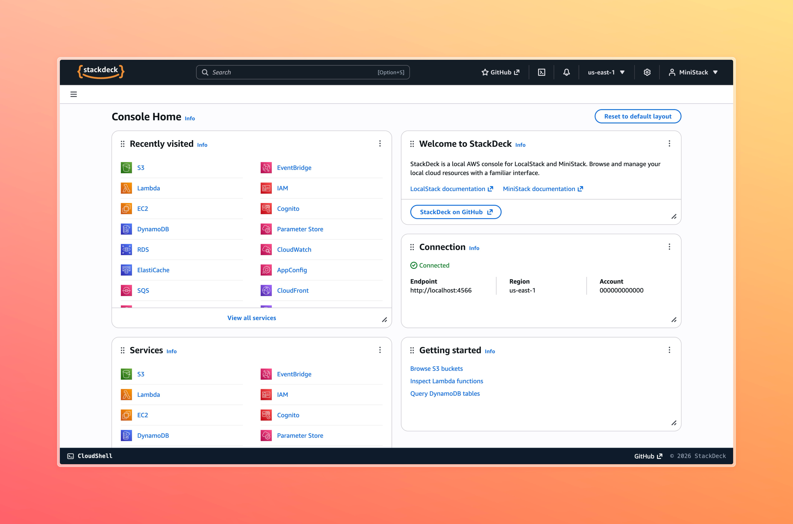
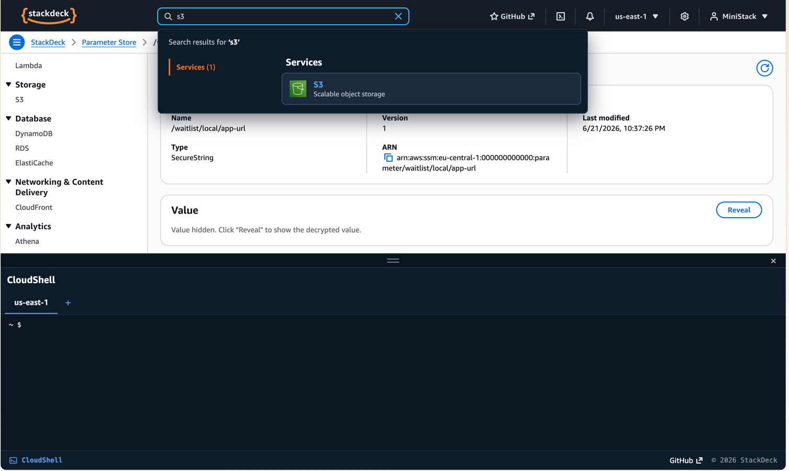
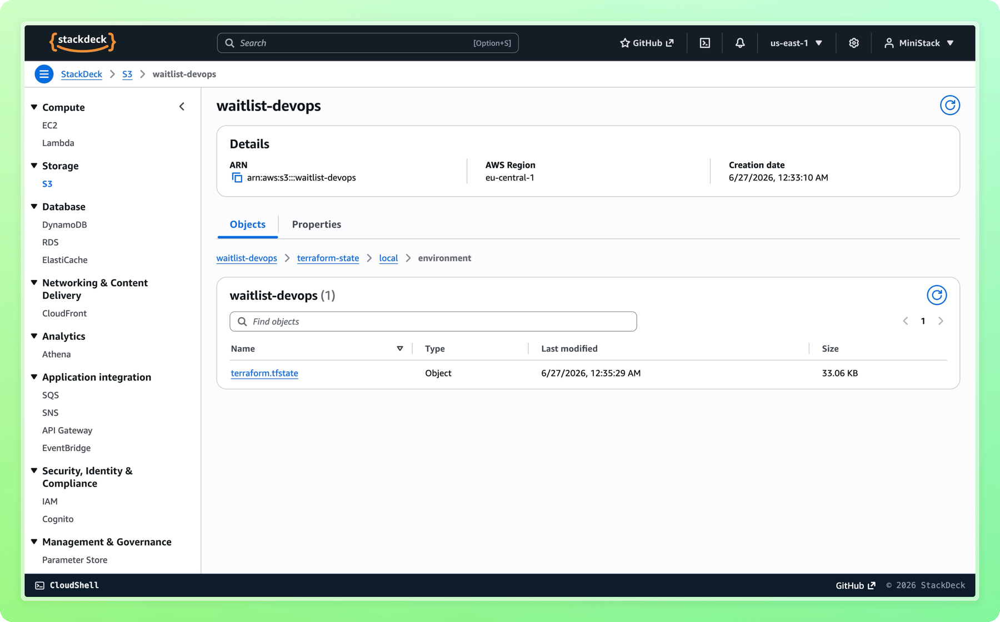
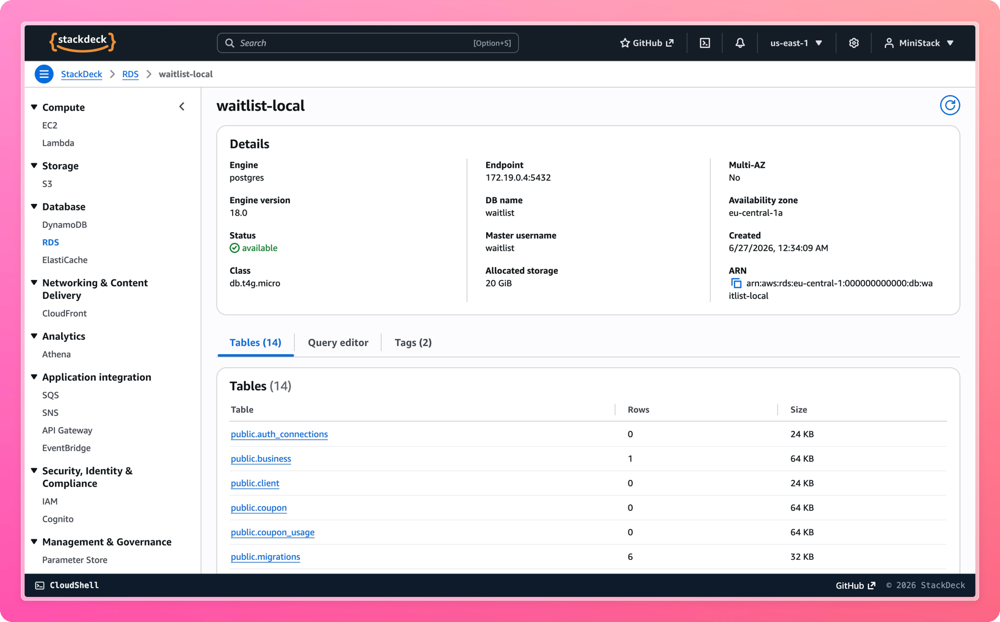

<div align="center">


### The AWS Management Console for your local cloud

**StackDeck** is a self-hosted, open-source web console for [**MiniStack**](https://ministack.org), [**LocalStack**](https://localstack.cloud), and [**Floci**](https://floci.io) — browse and manage your local AWS resources through a faithful recreation of the real AWS Console.

📖 **[Read the documentation →](https://liammizrahi.github.io/stackdeck/)**


[](https://liammizrahi.github.io/stackdeck/)

</div>

---

## ✨ Why StackDeck?

Local AWS emulators are fantastic for development, but you usually poke at them through the CLI or `curl`. StackDeck gives you the **real console experience** on top of your local endpoint:

- 🎯 **Looks like the real thing** — a faithful recreation of the AWS Management Console.
- 🔌 **Zero config** — defaults to `http://localhost:4566`; one env var to point it elsewhere.
- 🗂️ **29 services and counting** — compute, containers, storage, networking, databases, messaging, security, and more, all wired to the live AWS SDK.
- 🧪 **Actually interactive** — create and manage resources through proper forms and wizards, not just read-only views.
- 🐳 **Self-hosted & open source** — a single Docker container; no account, no telemetry, no cost.

## 📑 Table of Contents

- [✨ Why StackDeck?](#-why-stackdeck)
- [📸 How it looks](#-how-it-looks)
- [🚀 Quick start](#-quick-start)
- [⚙️ Configuration](#-configuration)
- [🧩 Services](#-services)
- [🧱 Tech stack](#-tech-stack)
- [🗺️ Roadmap](#-roadmap)
- [🔗 Related projects](#-related-projects)
- [🤝 Contributing](#-contributing)
- [⭐ Star history](#-star-history)
- [🤍 Contributors](#-contributors)
- [📄 License](#-license)

## 📸 How it looks

<table>
<tr>
<td width="50%" align="center">

<br/>
<sub><i>Console Home</i></sub>
</td>
<td width="50%" align="center">

<br/>
<sub><i>Resource Management</i></sub>
</td>
</tr>
<tr>
<td width="50%" align="center">

<br/>
<sub><i>S3 Browser</i></sub>
</td>
<td width="50%" align="center">

<br/>
<sub><i>RDS Explorer</i></sub>
</td>
</tr>
</table>

## 🚀 Quick start

StackDeck is published as a Docker image — pull it and point it at any LocalStack
or MiniStack endpoint. No checkout, no build step. AWS settings are optional and
default to a local emulator on `http://localhost:4566`.

### Add to your `docker-compose.yml` (recommended)

Drop the service in next to your emulator and point it at the right endpoint:

```yaml
services:
  stackdeck:
    image: ghcr.io/liammizrahi/stackdeck:latest
    ports:
      - "4577:4577"
    environment:
      AWS_ENDPOINT_URL: http://localhost:4566   # point at your emulator
    depends_on:
      - ministack   # optional — omit if you use LocalStack or an external emulator
```

Then `docker compose up` and open **[http://localhost:4577](http://localhost:4577)**. 🎉

### Run with `docker run`

```bash
docker run --rm -p 4577:4577 \
  --add-host=host.docker.internal:host-gateway \
  -e AWS_ENDPOINT_URL=http://host.docker.internal:4566 \
  ghcr.io/liammizrahi/stackdeck
```

(`host.docker.internal` lets the container reach an emulator running on your host.)

## ⚙️ Configuration

All AWS settings are **optional** — StackDeck defaults to a local emulator on
`http://localhost:4566` with throwaway credentials. Override any of them via
environment variables:

| Variable | Default | Description |
| --- | --- | --- |
| `AWS_ENDPOINT_URL` | `http://localhost:4566` | Local AWS endpoint (MiniStack / LocalStack) |
| `AWS_REGION` | `us-east-1` | Region used for all clients |
| `AWS_ACCESS_KEY_ID` | `test` | Dummy credentials for the emulator |
| `AWS_SECRET_ACCESS_KEY` | `test` | Dummy credentials for the emulator |

> [!IMPORTANT]
> **Networking inside Docker:** `localhost` points at the StackDeck container
> itself, not your host. When running in a container, set `AWS_ENDPOINT_URL` to
> either your emulator's **Compose service name** (e.g. `http://ministack:4566`)
> or **`http://host.docker.internal:4566`** to reach an emulator on your host
> (add `--add-host=host.docker.internal:host-gateway` on Linux).

Running from source? You can also put these in `apps/web/.env.local`.

## 🧩 Services

| Category | Services |
| --- | --- |
| **Compute** | EC2 · Lambda |
| **Containers** | ECS · ECR |
| **Storage** | S3 · EFS |
| **Database** | DynamoDB · RDS · ElastiCache |
| **Networking & Content Delivery** | VPC · Load Balancers · CloudFront · Route 53 |
| **Analytics** | Athena · Kinesis · Data Firehose · Glue · OpenSearch |
| **Application Integration** | SQS · SNS · API Gateway · EventBridge · EventBridge Scheduler · Step Functions · AppSync · SES |
| **Security, Identity & Compliance** | IAM · Cognito · Secrets Manager · KMS · Certificate Manager |
| **Management & Governance** | CloudFormation · CloudTrail · CloudWatch · Parameter Store · AppConfig · Backup · Organizations |

### Highlights

- **RDS explorer** — browse tables, run ad-hoc SQL in a syntax-highlighted editor, add / edit / delete rows, and spin up new instances through a multi-step wizard.
- **CloudWatch Logs** — stream-by-stream viewer with live tailing, time-range filters, and JSON expansion.
- **S3 browser** — navigate prefixes, preview objects, copy ARNs.
- **Create wizards & forms** — resource creation uses Cloudscape wizards/forms instead of bare modals.

> [!NOTE]
> The RDS **SQL editor** and **row editing** run queries by exec'ing into the local
> database container, so they need access to the host Docker socket. They work out of
> the box when running from source; in Docker, mount `/var/run/docker.sock` into the
> StackDeck container and use an image that includes the Docker CLI.

## 🧱 Tech stack

- **[Next.js 16](https://nextjs.org)** (App Router, React Server Components, Server Actions) + **React 19**
- **[Cloudscape Design System](https://cloudscape.design)** — AWS's open-source console components
- **[AWS SDK for JavaScript v3](https://docs.aws.amazon.com/sdk-for-javascript/v3/developer-guide/welcome.html)**
- **TypeScript** (strict) · **[Turborepo](https://turborepo.com)** monorepo · **Vitest** · **ESLint** · **Prettier**

## 🗺️ Roadmap

- More services (Step Functions, Secrets Manager, Kinesis, …)
- Deeper write operations and resource editing
- Multi-arch published images and versioned releases

## 🔗 Related projects

StackDeck sits on top of a local AWS emulator — point it at whichever you prefer:

- **[MiniStack](https://ministack.org)** — local AWS cloud emulator (default endpoint `http://localhost:4566`).
- **[LocalStack](https://localstack.cloud)** — fully featured local AWS cloud stack.
- **[Floci](https://floci.io)** — fast, free, open-source AWS emulator and drop-in LocalStack alternative on port `4566`.
- **[Cloudscape Design System](https://cloudscape.design)** — the open-source components that power StackDeck's console look and feel.

## 🤝 Contributing

Contributions are very welcome — new services, bug fixes, and polish alike.

**Local setup** (requires **Node.js ≥ 18**):

```bash
git clone https://github.com/liammizrahi/stackdeck.git
cd stackdeck
npm install
npm run dev        # http://localhost:4577
```

**Opening a pull request**

1. **Fork** the repository and create a branch: `git checkout -b feat/my-change`
2. Make your change. New services follow a repeatable pattern — a `lib/aws/<service>.ts` data layer plus an `app/services/<service>/` route with list and detail pages.
3. Run the checks locally before committing:
   ```bash
   npm run check-types && npm run lint && npm run build
   ```
4. Commit with a clear message and **push** to your fork.
5. **Open a PR** against `main` describing what changed and why. For larger changes, open an issue first to discuss the approach.

**Useful commands**

| Command | Description |
| --- | --- |
| `npm run dev` | Dev server on port **4577** |
| `npm run build` | Production build |
| `npm run lint` | ESLint (zero-warning policy) |
| `npm run check-types` | TypeScript type-check |
| `npm run test -w web` | Vitest unit tests |
| `npm run format` | Prettier across the repo |

## ⭐ Star history


## 🤍 Contributors

<a href="https://github.com/liammizrahi/stackdeck/graphs/contributors">
  
</a>

## 📄 License

[MIT](LICENSE) © Liam Mizrahi

<div align="center">
<sub>StackDeck is not affiliated with Amazon Web Services. "AWS" and related marks are trademarks of Amazon.com, Inc. or its affiliates.</sub>
</div>
